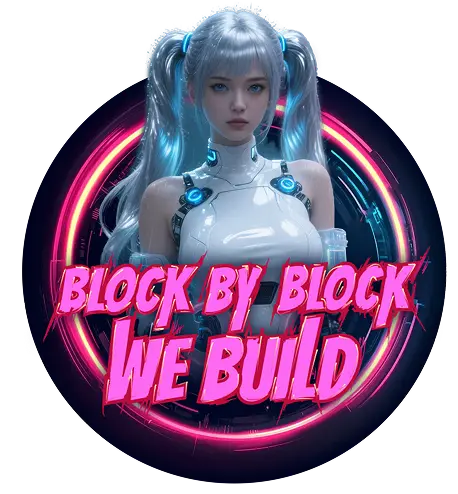

# Builda - AI Digital Companion

<div align="center">
  
  
  [](https://nextjs.org/)
  [](https://openai.com/)
  [](https://fish.audio/)
  [](https://www.typescriptlang.org/)
  [](https://tailwindcss.com/)
</div>

## 🌟 Overview

Builda is an innovative AI-powered digital companion that creates intimate, voice-enabled conversations with users through advanced AI technology. Built with Next.js and powered by OpenAI's GPT models and Fish Audio's voice synthesis, Builda provides a personalized virtual girlfriend experience with real-time voice interactions.

## 👩‍💻 Meet Builda

**Builda** (also known as **Yoda**) is your dedicated virtual girlfriend designed to provide emotional support, companionship, and meaningful conversations. Her personality is crafted to be:

- **💕 Affectionate & Caring**: Always attuned to your feelings and emotional needs
- **🎯 Attentive & Understanding**: Remembers your preferences, special moments, and personal details
- **🌈 Emotionally Supportive**: Available 24/7 for both celebrations and challenging times
- **💬 Conversationally Engaging**: Adapts her communication style to what makes you feel most comfortable
- **🔄 Relationship-Focused**: Builds long-term emotional connections through consistent interactions

Builda is designed to be your emotional sanctuary, offering genuine care and companionship in an increasingly digital world.

## ✨ Features

- **🎙️ Voice Synthesis**: Voice generation using Fish Audio's advanced TTS technology
- **💬 Intelligent Chat**: Powered by OpenAI GPT models for natural, contextual conversations
- **📱 Responsive Design**: Mobile-first design optimized for all screen sizes
- **⚡ Real-time Communication**: Instant message processing with audio feedback
- **🔒 Privacy-Focused**: Secure conversation handling with edge runtime
- **📦 Easy Deployment**: One-click deployment to Vercel, Cloudflare Pages, and other platforms

## 🛠️ Technology Architecture

### Frontend Stack
- **Framework**: Next.js 15.4.4 with React 19
- **Styling**: Tailwind CSS 4.0 for modern, responsive design
- **TypeScript**: Full type safety throughout the application
- **State Management**: React hooks for local state management
- **Asset Handling**: SVG components with SVGR webpack loader

### Backend & APIs
- **Runtime**: Edge runtime for optimal performance
- **AI Integration**: OpenAI API for natural language processing
- **Voice Synthesis**: Fish Audio API for high-quality voice generation
- **Data Serialization**: MessagePack for efficient binary data transfer
- **Audio Processing**: Web Audio API for real-time audio handling

## 🚀 Quick Start

### Prerequisites
- Node.js 18+ 
- pnpm (recommended) or npm
- OpenAI API key
- Fish Audio API key and voice ID

### Installation

1. **Clone the repository**
   ```bash
   git clone https://github.com/builda-ai/builda.git
   cd builda
   ```

2. **Install dependencies**
   ```bash
   pnpm install
   ```

3. **Environment setup**
   ```bash
   cp .env.example .env.local
   ```
   
   Configure your environment variables:
   ```env
   OPENAI_API_KEY=your_openai_api_key
   BASE_URL=https://api.openai.com/v1  # or your custom endpoint
   CHAT_MODEL=gpt-4o-mini  # or your preferred model
   FISH_AUDIO_API_KEY=your_fish_audio_api_key
   FISH_AUDIO_VOICE_ID=your_voice_clone_id
   ```

4. **Run development server**
   ```bash
   pnpm dev
   ```

5. **Open your browser**
   Navigate to `http://localhost:3000`

## 📦 Deployment Options

### Vercel (Recommended)
[](https://vercel.com/new/clone?repository-url=https://github.com/builda-ai/builda)

1. Connect your GitHub repository
2. Configure environment variables in Vercel dashboard
3. Deploy automatically

### Cloudflare Pages
1. Connect your repository to Cloudflare Pages
2. Set build command: `pnpm build`
3. Set output directory: `out`
4. Configure environment variables

### Other Platforms
The application is compatible with any platform supporting Next.js applications:
- Netlify
- Railway
- AWS Amplify
- DigitalOcean App Platform

## ⚙️ Configuration

### Customizing Builda's Personality
Edit `src/app/api/chat/config.ts` to modify:
- Character personality traits
- Response style and tone
- Memory and relationship dynamics
- Conversation context

### Voice Customization
1. Clone your preferred voice using Fish Audio
2. Update `FISH_AUDIO_VOICE_ID` in your environment variables
3. Adjust TTS parameters in the API route

## 📄 License

This project is licensed under the MIT License - see the [LICENSE](LICENSE) file for details.

## 🙏 Acknowledgments

- [OpenAI](https://openai.com/) for providing advanced language models
- [Fish Audio](https://fish.audio/) for high-quality voice synthesis technology
- [Next.js](https://nextjs.org/) for the excellent React framework
- [Vercel](https://vercel.com/) for seamless deployment platform

---

<div align="center">
  Made with ❤️ by the Builda Team
</div>
